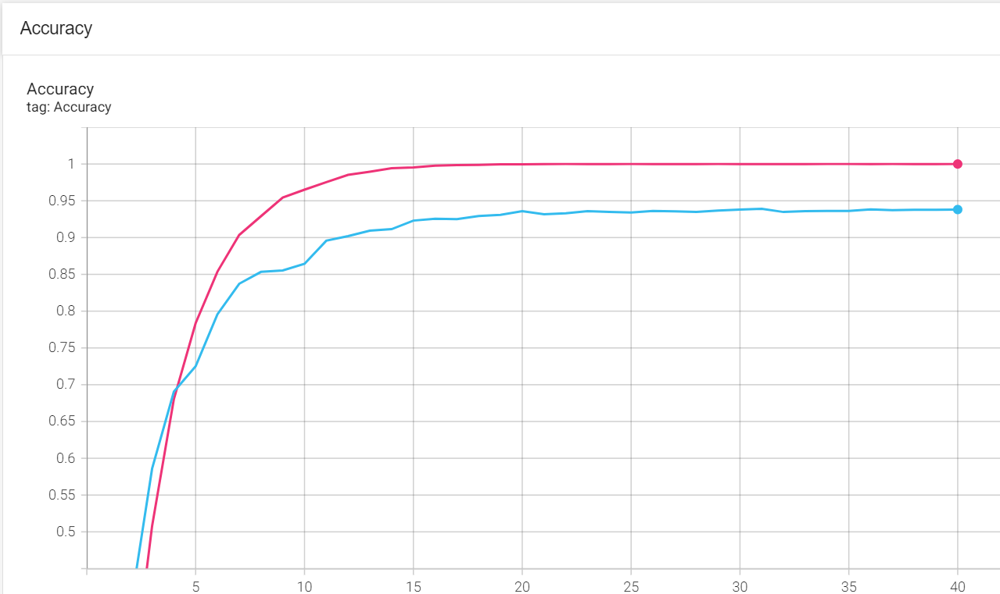
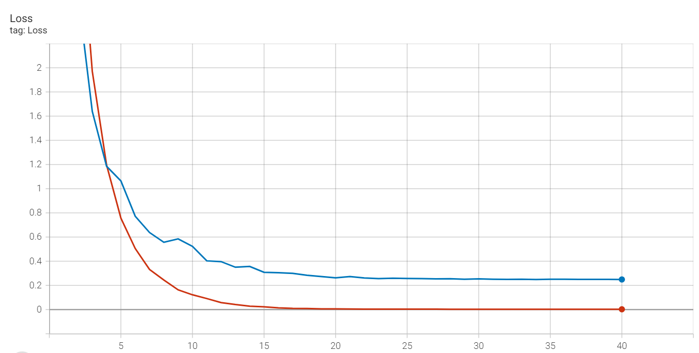

## Dataset Prepare

To train the model, first need to download [Market1501]

### Seperate market1501 to category dataset

To separate the Market1501 dataset into different categories, use the `prepare_market1501.py` script:

```python
usage: prepare_market1501.py [--source_dir]
                             [--target_dir]
```
```bash
python train.py --source_dir [dataset/path] --target_dir [dataset/category_path]
```

## Training the RE-ID model

The reid model is actually a Resnet18 but get the features before fc layer. We train the model and set the number of classes as 1501 which is number of classes in market1501.

```python
usage: train.py [--data_dir]
                [--epochs]
                [--batch_size]
                [--lr]
                [--freeze_layer]
                [--checkpoint_path]
                [--save_checkpoints_folders]
```
```bash
python train.py --data_dir [dataset/category_path] --save_checkpoints_folder [checkpoints]
```

## View TensorBoard Results

We save the results of TensorBoard to the `/runs` directory.

### Open TensorBoard

1. **Find Docker Container ID**

    Run the following command in the terminal to find the running Docker container ID:

    ```bash
    sudo docker ps
    ```

    Assuming the container ID is 6dcb8ed5d22c.

2. **Enter Docker Container**

     Use the following command to enter the Docker container:
     ```bash
     sudo docker exec -it 6dcb8ed5d22c /bin/bash
    ```

3. **Start TensorBoard**

     Inside the container, run the following command to start TensorBoard:
     ```bash
     tensorboard --logdir=reid/runs --host 0.0.0.0 --port 5000
     ```

## Predict and Feature extraction example

```python
usage: pred.py [--img_path]
                [--checkpoint_path]
```
```bash
python pred.py --img_path [dataset/img_path.jpg] --checkpoint_path [checkpoint]
```

## Convert Resnet18reid to onnx 

To conver resnet18reid model to onnx format, use the `conver_reid_to_onnx.py` script:

```python
usage: conver_reid_to_onnx.py [--checkpoint_path]
                              [--output_onnx_path]
```
```bash
python conver_reid_to_onnx.py --checkpoint_path [checkpoint] --output_onnx_path [onnx_path]
```

## Training Result

